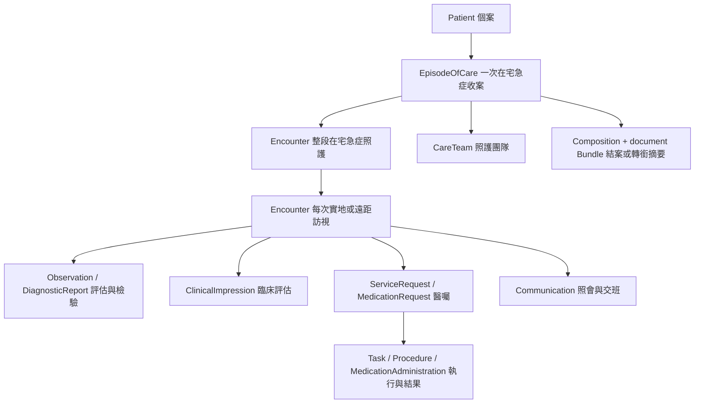

在宅急症資料集與 IG Profiles 建議

掃描日期：2026-09-17。這份文件是根據程式碼提出的資料交換設計建議，尚未建立 FSH，也未宣稱系統資料已通過任何 Profile 驗證。

建議在現有 TW LTC IG 中增設「在宅急症」主題，以一次收案療程為主軸，串聯訪視、診斷、檢驗、處方、給藥、照護計畫、照會及結案轉銜。優先解決療程識別、臨床資料結構化及跨機構文件交換，再納入申報與補助。

**掃描範圍與證據限制。**

| Repository | 掃描版本 | 結果 |
|---|---|---|
| [HaH-dashboard](https://github.com/SitatechCo/HaH-dashboard) | 無 commit | GitHub 回覆 repository is empty。無程式可分析，不能據此推定有儀表板功能。 |
| [HaH-backend](https://github.com/SitatechCo/HaH-backend/tree/6fbc1c3fef80d25b7e675efe6e500527bc6293ba) | `6fbc1c3fef80d25b7e675efe6e500527bc6293ba` | FastAPI；FHIR 代理、帳號與人員、交班通知、視訊、圖檔、OCR、檢驗排序、居護資料轉送。 |
| [HaH-frontend-mobile](https://github.com/SitatechCo/HaH-frontend-mobile/tree/2838819fe9c602b14fdf007065b8ef90b60d9eb8) | `2838819fe9c602b14fdf007065b8ef90b60d9eb8` | Quasar/Vue；主要臨床資料組裝與流程在此，也包含桌面顯示分支。 |

已下載兩個非空 repo 的預設分支快照，掃描前端 `src/`、資源模板、路由、後端 `routers/` 與 models，並閱讀主要資料產生與更新路徑。未執行應用程式，未讀取正式病人資料，未呼叫臨床或通知 API。外部 FHIR Server、圖床、檢驗來源及其他未指定 repo 的實作不在本次範圍內。「未找到」指這些快照內未找到實作，不代表整個產品一定沒有該能力。

本地 IG 依據目前工作目錄的 FSH 與 `sushi-config.yaml` 分析，版本設定為 FHIR R4 4.0.1、TW Core 1.0.0。`home-nursing/` 當下為未追蹤的新增內容，因此列為工作中的可參考設計，不視為已發布規範。既有工作目錄修改均保留。

**實際流程、資料與資源。**

| 流程 | 程式可確認的資料或行為 | 目前使用的 Resources／儲存方式 | IG 設計方向 |
|---|---|---|---|
| 建檔、待收案、收案 | 個案識別、姓名、性別、生日、地址、電話、緊急聯絡人、照顧者、收案階段與日期、主責院所與人員 | `Patient`、`Person`；階段放 `meta.tag`，部分資料放 Extension | Patient 保留身分主檔；一次療程改由 `EpisodeOfCare` 識別；需跨資源參照的照顧者用 `RelatedPerson`。 |
| 在宅住院開始與結束 | 入院／出院日期、主責醫師、護理師、協調師、診斷 | `Encounter`，住院 `class=IMP`；`Condition`；住院結束改為 `finished` | 明確區分整段照護 Encounter、每次訪視 Encounter 與收案 EpisodeOfCare。 |
| 主責與共照團隊 | 主責機構、居護所、共照機構、人員、角色 | `Patient.generalPractitioner`、`Encounter.participant`、`CareTeam`；後端建立 `Practitioner`、`PractitionerRole` | 用有期間的團隊成員與人員角色表達責任，不靠陣列位置或 display 判別角色。 |
| 排訪、工作指派、送藥 | 日期、負責人、地址、座標、工作項目、完成狀態、費用、送藥簽收列印 | `Task`；內嵌 `CareTeam`、`Location`；大量工作資訊在 `Task.note` JSON | Task 表達執行工作；服務需求由 ServiceRequest／CarePlan 表達。送藥完成不能推定病人已用藥。 |
| 醫師與護理訪視 | SOAP、自由文字、護理目標／措施、病情、交班、家屬溝通、設備、轉送、補助資訊 | `Encounter`、`ClinicalImpression`、`Observation`、`DocumentReference`；多種欄位包成 JSON 放在 `ClinicalImpression.note` | 保留臨床評估；已執行處置、實測值、通訊與費用拆成適當 Resources。完整紀錄文件用 Composition 彙整。 |
| 生命徵象與遠距監測 | 體溫、SpO₂、心跳、血壓、呼吸、血糖；設備綁定／解除 | `Observation`、`Device`；血壓有收縮壓／舒張壓 component | 生命徵象與血糖分開建模；明確記錄量測時間、人員、方法、設備與就診。 |
| 現場檢測與檢驗趨勢 | 血氣、電解質、乳酸、腎功能、CRP 等表單與 OCR；外部檢驗值與參考區間 | 檢驗頁讀取 `Observation`；現場 `diagnosticSigns` 部分置於臨床紀錄 JSON | 建立檢驗 Observation 與 DiagnosticReport；有檢體與醫囑時串聯 Specimen、ServiceRequest。 |
| 護理問題、目標、計畫與評值 | 需求摘要、目標、預期日期、措施、評值與上傳居護服務 | `Goal`、`CarePlan`；部分評值在 `ClinicalImpression.note`；另轉為居護 JSON | 問題用 Condition，預期結果用 Goal，計畫用 CarePlan，實際執行／評值用 Procedure／Observation／ClinicalImpression。 |
| 專科照會、回覆、共照 | 發起者、被照會醫師、內容、附件、回覆及已讀；補助申請 | `ServiceRequest → Communication`；`DocumentReference`；補助 `Task` | 可直接作為照會與通訊 Profiles 的起點；把行政補助與臨床照會分開。 |
| 值班交班、視訊聯絡 | 交班對象、就診、臨床紀錄、通知時間與已讀；視訊會議／通知 | 交班通知在 SQL，指向 `ClinicalImpression`；視訊使用專用 API | 交換臨床交班用 Communication；實際遠距診療才建立 Encounter，視訊邀請不等於完成診療。 |
| 風險、特殊照護需求 | DNR、過敏警示、腎病、傷口、鼻胃管／導尿管／氣切、氧療方式與流量、功能狀態 | 泛用 `Condition` 的 note／JSON | 分流為 AllergyIntolerance、Condition、Observation、Procedure、Device；意願／同意及醫囑分開處理。 |
| 結案、暫停、轉送與後續照護 | 結案時間、死亡／暫停原因；急診轉銜院所；非計畫住院／急診等欄位 | `Patient` Extension／active、`Encounter.period/status`、臨床 note JSON | EpisodeOfCare 記錄療程狀態與結束原因；Encounter 記錄轉出處置；轉銜需求與摘要分別用 ServiceRequest、Composition/Bundle。 |
| 收費、補助、對外上傳 | 自費、部分負擔、代收、跨區／值班／專科照會補助、居護上傳 | 臨床與 Task note JSON、加值 `Task`、非 FHIR JSON API | 第二階段評估 ChargeItem／Invoice／Claim；不能直接把長照費用核銷 Profile 當成在宅急症健保申報規範。 |

上表是系統使用與建議建模的對照，右欄不是既有功能宣告。尤其前端 `summaryNote.vue` 含固定測試姓名、NEWS 分數等示意資料，不能當作已實作風險評分或結案摘要交換的證據。

**Profiles 現況。**

前端可見 `meta.profile` 宣告 TW Core Patient、Encounter、Condition、Observation-vitalSigns、DocumentReference。CareTeam 的一處宣告被註解。程式沒有隨附在宅急症專用 StructureDefinition／FSH。宣告 URL 只表示資料聲稱符合該 Profile，無法取代驗證。

護理紀錄另宣告 `ClinicalImpression-twcore`，但本地 IG 依賴的 `tw.gov.mohw.twcore#1.0.0` 套件沒有這個 StructureDefinition。若依現行 IG 依賴實作，建議自行從 R4 ClinicalImpression 建立 Profile；不能直接把該 URL 當成可用 Parent。這是針對 1.0.0 套件的確認，並未推論所有後續版本皆不存在。

**建議的療程關聯。**

圖中的箭頭表示業務關係，不表示所有箭頭都有同名 FHIR 欄位。實際 Reference 方向包括 `EpisodeOfCare.patient → Patient`、`Encounter.episodeOfCare → EpisodeOfCare`、子 `Encounter.partOf → 整段照護 Encounter`、`Observation.encounter → Encounter`、`MedicationAdministration.request → MedicationRequest`。CarePlan 若需直接連到療程，R4 沒有原生 episodeOfCare 欄位，須制定適用 Extension，或在明確規範下經 Encounter 串聯。

EpisodeOfCare 表示機構負責的一段照護歷程，Encounter 表示具體就診／照護互動；多機構各自管理的 EpisodeOfCare 應有共同的轉介或案件識別對照，不宜假定一個資源會跨機構共用狀態。這個區分依據 [FHIR R4 EpisodeOfCare](https://hl7.org/fhir/R4/episodeofcare.html) 與 [Encounter](https://hl7.org/fhir/R4/encounter.html)。

現有程式的 `IMP`／`HH` 是實作現況，尚不等於 IG 已採用的分類規則。整段在宅照護與單次實地／遠距訪視的 class、type 及 location，應共同確認後固定；不要把每次電話聯絡都當成住院。EpisodeOfCare 在 R4 沒有原生結束原因欄位，若要直接記錄結束原因，需正式 Extension；Encounter 的出院處置則可使用 hospitalization.dischargeDisposition。

**建議建立的核心 Profiles。**

下列 `HAH...` 為建議名稱。A 表示程式已有對應資料，可先規範化；B 表示完成在宅急症資料集建議補上的結構，不能當成目前已實作。兩者都可納入第一版目標，但 B 需要同步補資料來源與登錄流程。欄位是設計重點，不是已議定的 cardinality。

| 建議 Profile | Resource／Parent 方向 | 類別 | 主要規範內容 |
|---|---|---|---|
| `HAHPatient` | TW Core Patient；符合全部 LTC 約束時才考慮 LTCPatient | A | 個案識別、姓名、出生日期、聯絡與居住地址、聯絡人；允許清楚表達尚未知的資料。 |
| `HAHEpisodeOfCare` | R4 EpisodeOfCare；患者符合 LTCPatient 時可用 LTCEpisodeOfCareBase | B | 收案識別、病人、負責機構、類型、狀態歷程、實際起訖、收案診斷、轉介來源、團隊、結束原因。 |
| `HAHAdmissionEncounter` | TW Core Encounter | A | 整段在宅急症照護、療程參照、收治來源、服務機構、主責人員、診斷、照護地點、出院／轉出結果。 |
| `HAHVisitEncounter` | TW Core Encounter | A | 每次訪視；實地／視訊／電話等方式、起訖、實際參與者、地點、所屬療程與整段照護。 |
| `HAHCondition` | TW Core Condition；LTCCondition 須先核對患者限制 | A | 收案主診斷、共病、照護問題、發病時間、臨床／確認狀態、對應就診。主次診斷順位由 Encounter／EpisodeOfCare 的 diagnosis 表達。 |
| `HAHCareTeam` | TW Core CareTeam | A | 主責醫師、護理師、藥師、協調師與共照機構；角色、成員與責任期間。 |
| `HAHCarePlan` | TW Core CarePlan；LTCCarePlan 須先核對 Reference 限制 | A | 急症治療與護理計畫、病情依據、目標、預定服務、作者、期間、療程關聯。 |
| `HAHGoal` | TW Core Goal；LTCGoal 須先核對患者限制 | A | 可評值的預期結果、期限、狀態、結果觀察；原「護理需求」欄位需先釐清語意。 |
| `HAHServiceRequest` | TW Core ServiceRequest | A/B | 照會、轉介、檢驗與處置請求；項目、狀態、intent、開立者、執行對象、時間、原因、就診。差異足夠大時才再分子 Profile。 |
| `HAHVisitTask` | R4 Task | A | 排訪、抽血、送藥、待辦；受益個案、負責者、focus/basedOn、預定期間、實際期間、狀態、輸出結果。 |
| `HAHClinicalImpression` | R4 ClinicalImpression | A | 臨床評估、評估者、時間、病人、就診、問題、發現、摘要與支持證據。避免把所有日常記事都視為臨床評估。 |
| `HAHCommunication` | R4 Communication | A | 專科照會回覆、交班、家屬衛教；發送／接收者、時間、主題、內容、依據請求及附件。已讀與接手處理要有明確區別。 |
| `HAHDocumentReference` | TW Core DocumentReference | A | 病歷附件、照片、簽署文件、報告／視訊檔案的索引；病人、作者、種類、狀態、時間、就診與檔案存取方式。 |
| `HAHObservationLab` | TW Core Observation-laboratoryResult | A | 血糖、CRP、血球、腎功能、血氣、乳酸等；項目代碼、檢體、值／缺值原因、單位、時間、參考區間與異常解讀。 |
| `HAHDiagnosticReport` | TW Core DiagnosticReport | B | 一次檢驗報告；狀態、時間、出具機構、所屬就診、醫囑、檢體、result 及原始報告。 |
| `HAHProcedure` | TW Core Procedure；LTCProcedureCareActivity 須先核對 Reference 限制 | B | 換藥、抽痰、管路更換等實際處置；項目、部位、起訖、執行者、依據醫囑、結果與未執行原因。 |
| `HAHMedicationRequest` | TW Core MedicationRequest | B | 藥品、處方狀態與 intent、適應症、劑量、頻率、途徑、療程、開立者及就診。 |
| `HAHMedicationAdministration` | R4 MedicationAdministration | B | 實際給藥／輸注；處方參照、給藥者、時間點或期間、劑量／速率、途徑、停止／未給藥原因與 context。 |
| `HAHAllergyIntolerance` | TW Core AllergyIntolerance | B | 過敏物質、反應、嚴重度／criticality、確認狀態、紀錄者；區分已知無過敏、未知與未評估。 |
| `HAHConsent` | R4 Consent | B | 在宅照護或資訊分享的同意種類、病人／代理人、適用期間、範圍、狀態、來源文件。DNR 意願與臨床醫囑另作具體設計，不能只用一個布林值取代。 |
| `HAHCompositionSummary` | LTCCompositionBase 或 TW Core Composition，核對 Reference 相容性 | B | 急轉院／結案摘要；收案原因、照護經過、診斷、過敏、用藥、關鍵結果、管路／氧療、轉出原因、未完成事項、後續照護與聯絡窗口。 |
| `HAHBundleSummary` | R4 Bundle，`type=document` | B | 第一筆 entry 為 HAHCompositionSummary；包含規範要求的參照資源、文件 identifier、timestamp、fullUrl 與內部參照規則。 |

生命徵象優先直接引用 TW Core 1.0.0 的 `Observation-body-temperature-twcore`、`Observation-heart-rate-twcore`、`Observation-bloodPressure-twcore`、`Observation-respiratory-rate-twcore`、`Observation-pulse-oximetry-twcore`。若需一致強制就診、量測來源、設備或 HaH 特有欄位，再各建相應的 HAH 子 Profile。不要只為改標題複製五套相同約束，也不要把現有 sports Profile 名稱直接當成在宅急症規範。

FHIR 將單筆檢驗結果交由 Observation、整份檢驗報告交由 DiagnosticReport 表達，兩者不可互相省略語意。參見 [FHIR R4 DiagnosticReport](https://hl7.org/fhir/R4/diagnosticreport.html)。處方、調劑、實際給藥及用藥陳述則是不同事件，參見 [FHIR R4 MedicationAdministration 的資源關係](https://hl7.org/fhir/R4/medicationadministration.html)。

**按交換需求再補充的 Profiles。**

| 建議 Profile／共用資源 | 適用情境與優先順序 |
|---|---|
| `HAHAssessmentResponse`／QuestionnaireResponse | 收案適合性、居家環境、照顧者能力與結案評值。收案評估建議納入第一版；先有經確認且具版本的 Questionnaire，再制定答案約束。不同正式表單可分子 Profile，不必每題一個 Profile。 |
| `HAHObservationClinical` 或具體的氧療／傷口／評分子 Profile | 要交換意識、疼痛、氧氣流量、氧療方式、傷口、NEWS 等結構化觀察時。先選定真正在用的量表與必要項目；目前示意 NEWS 不構成算法實作證據。量表分數可用 Observation，風險預測才評估 RiskAssessment。 |
| `HAHDevice` | 設備監測納入交換時規範識別碼、類型、狀態與量測關聯。一般設備代號不應一律當成正式 UDI。 |
| TW Core Specimen／`HAHSpecimen` | 血液、尿液、痰液、培養等檢體的識別、種類、採集時間與採集者。TW Core 足夠時直接引用；細菌培養／藥敏須進一步確認報告結構。 |
| TW Core Medication | 藥品識別、劑型、成分；複方／配製輸液需要時補 HAH 約束。 |
| TW Core MedicationStatement／`HAHMedicationStatement` | 收案用藥整合、外院用藥與病人／照顧者陳述，不能由送藥 Task 推定。 |
| TW Core MedicationDispense／`HAHMedicationDispense` | 有可交換的調劑與發藥事件時使用。純配送／代領工作維持 Task，並連結調劑紀錄與簽收文件。 |
| `HAHAdverseEvent`、`HAHFlag` | 分別記錄不良事件與需要立即注意的警示。急轉院本身不必然是不良事件。既有 LTCAdverseEvent 可先核對適用性。 |
| `HAHProvenance` | 跨機構資料來源、轉換來源、文件版本、AI 草稿與人員確認的來源追溯。AuditEvent 則處理存取稽核，兩者分工。 |
| ChargeItem／Invoice／Claim／ClaimResponse | 確認在宅急症費用資料集與外部交換介面後另立行政模組，避免把補助資格的本地規則直接變成臨床資料約束。 |
| Appointment／Schedule／Slot | 未來有跨系統的預約、時段與可用性交換時再納入；目前 Task 排程不足以推定這些 Resources 已實作。 |

Organization、Practitioner、PractitionerRole、RelatedPerson、Location 優先引用相容的 LTC／TW Core Profiles。Person、List、Parameters 是現有系統可能使用的輔助 Resources，不因畫面或 API 使用它們，就需要新增 HaH 專用 Profile。

**既有 IG 的重用限制。**

| 現有定義 | 可重用處 | 在宅急症要注意的限制 |
|---|---|---|
| [LTCPatient](../input/fsh/profiles/profile_patient.fsh) | 個案身分與聯絡資訊 | 強制機構住民識別 Slice、電話、地址及緊急聯絡人等；HaH 待收案資料可能不具備。若採 TW Core 的平行 HAHPatient，其他資源也不能繼承強制 Reference(LTCPatient) 的 Parent 後再放寬。 |
| [LTCEpisodeOfCareBase](../input/fsh/profiles/profile_episodeOfCare_base.fsh) | 狀態、期間、機構等療程骨架 | patient 已限定 LTCPatient。患者設計不相容時，HAHEpisodeOfCare 應直接從 R4 衍生。 |
| [LTCCareTeam](../input/fsh/profiles/profile_careTeam.fsh) | 個案與人員角色 | participant.member 限定人員／關係人／角色，不能直接納入 repo 使用的 Organization 成員。建議 HAHCareTeam 由 TW Core 衍生。 |
| [LTCTask](../input/fsh/profiles/profile_task.fsh) | 任務管理基本語意 | owner 已限制為人員、角色或機構；repo 的 contained CareTeam owner 不相容。若保留團隊 owner，須由 R4 Task 建立平行 Profile。 |
| [LTCMedicationAdministration](../input/fsh/profiles/profile_medicationAdministration.fsh) | 給藥劑量與途徑設計 | `effectiveDateTime 1..1` 排除 effectivePeriod；dosage 與 dose 強制必填也要評估未給藥情境。持續輸注建議直接從 R4 建新 Profile，不能在子 Profile 放寬 Parent。 |
| [LTCCarePlan](../input/fsh/profiles/profile_carePlan.fsh)、LTCGoal、LTCCondition | 計畫、目標、病情 | 核對 Reference 及必填限制；不把護理問題直接等同預期目標。CarePlan.partOf 是計畫從屬關係，不能僅因原說明用語而用作所有緊急備案。 |
| [LTCCompositionBase](../input/fsh/profiles/profile_composition_base.fsh) | 文件組成基礎 | 適合新增 HaH 摘要子 Profile，仍須核對 TW Core 的完整父層約束。既有 CMS／Referral Bundle 的專屬 Slice 不直接套用。 |
| [HN 資源](../input/fsh/profiles/home-nursing/profile_home_nursing_resources.fsh) | 居護表單、計畫、評值、收案關聯的設計經驗 | 多個 Profile 強制 `sourceForm`；HNCarePlan 強制 activity.detail 並禁止 activity.reference，無法直接用來承接一般急症醫囑連結。且本次仍屬未發布的工作目錄內容。 |

建議採「共用身分／機構規範 + HaH 專用療程與臨床規範」；相容的 Parent 才繼承。這能保留現有長照、居護 Profiles 的用途，避免為新增在宅急症而放寬既有資料契約。

**制定 Profile 前需處理的資料語意。**

| 現況 | 建議處理 |
|---|---|
| 收案階段與日期在 Patient tag／Extension，結案可能影響 Patient.active | 每次收案獨立 EpisodeOfCare；死亡用 Patient.deceased[x]，不能由病例結案直接推定 Patient 身分資料停用。參見 [Patient.active 定義](https://hl7.org/fhir/R4/patient-definitions.html#Patient.active)。 |
| SOAP、檢測、轉送、護理措施、費用混在 note JSON | 指定逐欄映射與型別。原文可保留為 note／來源文件，但關鍵診斷、數值、藥物、處置與轉銜不能只靠解析 JSON 字串。 |
| Goal.description 現存「護理需求」，CarePlan.description 現存「護理目標」 | 先決定需求、問題、目標與計畫的語意，分別映射 Condition、Goal、CarePlan，不直接依現有欄位名稱發布規範。 |
| 血糖宣告 Observation-vitalSigns | 血糖歸檢驗／適當一般觀察 Profile；各項 vital sign 採對應代碼、單位與結構。這是分類與建模問題，並非本次已跑 validator 確認所有此類資料均失敗。參見 [R4 Vital Signs](https://hl7.org/fhir/R4/vitalsigns.html)。 |
| 部分生命徵象以 Observation.focus 連 ClinicalImpression | 就診用 Observation.encounter；評估支持證據用 ClinicalImpression.supportingInfo 等合理連結。focus 是觀察所針對的焦點，不作一般紀錄外鍵。參見 [Observation.focus](https://hl7.org/fhir/R4/observation-definitions.html#Observation.focus)。 |
| Task.executionPeriod 用作預定工作時間 | 區分預定與實際執行；Task.restriction.period 可表達限期，executionPeriod 用於實際執行期間。參見 [Task 定義](https://hl7.org/fhir/R4/task-definitions.html)。 |
| 部分日期缺值以 `9999-01-01` 補入；部分附件時間把 Z 直接替換為 +08:00 | 缺值策略與時區轉換需制定；未知日期不能製造假資料，UTC 轉換要保留同一時間點。 |
| Extension／CodeSystem URL 與 VITE_FHIR_BASE_URL 綁定 | 定義穩定 canonical；FHIR API 部署網址與資料規範識別碼分離。建立正式 StructureDefinition、CodeSystem、ValueSet，保留舊碼對照。 |
| 外部檢驗結果靠支付代碼與文字關鍵字判別 | 保留來源代碼；經檢體、方法、單位確認後建立 ConceptMap，不能從健保申報代碼直接推定唯一 LOINC。 |
| DNR、過敏、傷口、氧療等同置一個特殊需求 Condition | 逐項分流；Consent 可保存同意／指示資訊與來源文件，但可執行醫囑與臨床警示仍需另行規範。參見 [FHIR R4 Consent](https://hl7.org/fhir/R4/consent.html)。 |

**文件交換與 API 交易應分別規範。**

目前前端常以 `Bundle.type=transaction` 一次寫入 Encounter、ClinicalImpression、Observation 與附件。這是伺服器寫入機制。跨院結案／轉銜摘要建議使用 `Bundle.type=document` 搭配 Composition，依 [FHIR R4 Documents](https://hl7.org/fhir/R4/documents.html) 規範文件識別、時間、第一筆 Composition 及文件內參照。

第一版可使用同一 HAHCompositionSummary，依文件 type 區分結案與急轉院；只有必要章節／必填條件明顯不同時，才拆成 HAHDischargeSummary、HAHTransferSummary 子 Profile。文件內要分清「沒有此項資訊」、「已確認沒有」及「未評估」。轉出對象收到摘要，不代表已接手；若需追蹤接收與承接，另外規範 Task／Communication。

**第一版交付建議。**

1. 先完成在宅急症 Logical Model 與來源欄位映射表。最小範圍涵蓋收案評估、療程、訪視、診斷、過敏、檢驗、處方／給藥、處置、團隊、照會、結案轉銜。
2. 先確定 Patient 的 Parent，接著實作 EpisodeOfCare 與兩種 Encounter，統一各臨床資源的病例／就診關聯。
3. 將既有實作 A 類資料結構化，並同步補上 B 類用藥、過敏、評估／同意與報告資料來源。無法提供的資料明確表達缺值，不憑空補值。
4. 建立生命徵象引用規則、必要的 HAH 子 Profile、CodeSystem／ValueSet、Extension 與 ConceptMap。收案條件、角色、訪視方式、結案原因與版本分開維護。
5. 建立結案／轉院 Composition 和 document Bundle；另寫 API CapabilityStatement、支援的搜尋條件、交易 Bundle 使用與錯誤回覆規則。
6. 建立正常完治、急轉院、再次收案、遠距訪視、給藥未執行／持續輸注等合成案例，驗證同一病人多療程、Reference 一致性、時間、單位、代碼與缺值情境。固定訪視頻率或給付資格等規則，須確認正式版本後才加入。

目前健保署入口列有 115 年 5 月 12 日公告版本。因此疾病範圍、收案條件、頻率與給付規則應由採用的正式計畫版本另行確認，本文件沒有根據 repo 補助常數推定法定要求。參見[健保署在宅急症照護試辦計畫](https://www.nhi.gov.tw/ch/cp-15112-18d97-3660-1.html)。

實作 FSH 後應執行 `sushi .`，再依本 repo 規定用 `https://tx.fhir.org` 完整執行 Publisher；術語服務不可用時停止，檢查 `output/qa.html`。這次僅新增分析文件，未改 FSH 或 IG 導覽，因此未執行編譯／Publisher。

**主要程式證據。**

| 範圍 | 固定 commit 的來源 |
|---|---|
| 個案與收案 | [patient.js](https://github.com/SitatechCo/HaH-frontend-mobile/blob/2838819fe9c602b14fdf007065b8ef90b60d9eb8/src/lib/fhirTemplate/patient.js)、[EnrollmentInfo.vue](https://github.com/SitatechCo/HaH-frontend-mobile/blob/2838819fe9c602b14fdf007065b8ef90b60d9eb8/src/components/patientDetails/EnrollmentInfo.vue) |
| 在宅住院／訪視 | [encounter.js](https://github.com/SitatechCo/HaH-frontend-mobile/blob/2838819fe9c602b14fdf007065b8ef90b60d9eb8/src/lib/encounter.js)、[EditHospitalization.vue](https://github.com/SitatechCo/HaH-frontend-mobile/blob/2838819fe9c602b14fdf007065b8ef90b60d9eb8/src/pages/patient/EditHospitalization.vue) |
| 共照與排訪 | [careTeam.js](https://github.com/SitatechCo/HaH-frontend-mobile/blob/2838819fe9c602b14fdf007065b8ef90b60d9eb8/src/lib/careTeam.js)、[task.js](https://github.com/SitatechCo/HaH-frontend-mobile/blob/2838819fe9c602b14fdf007065b8ef90b60d9eb8/src/lib/fhirTemplate/task.js) |
| 診斷／特殊需求 | [condition.js](https://github.com/SitatechCo/HaH-frontend-mobile/blob/2838819fe9c602b14fdf007065b8ef90b60d9eb8/src/lib/condition.js) |
| 臨床與護理紀錄 | [clinicalNote.js](https://github.com/SitatechCo/HaH-frontend-mobile/blob/2838819fe9c602b14fdf007065b8ef90b60d9eb8/src/lib/clinicalNote.js)、[fhirResources.js](https://github.com/SitatechCo/HaH-frontend-mobile/blob/2838819fe9c602b14fdf007065b8ef90b60d9eb8/src/lib/fhirResources.js)、[CreateNursingNote.vue](https://github.com/SitatechCo/HaH-frontend-mobile/blob/2838819fe9c602b14fdf007065b8ef90b60d9eb8/src/pages/note/CreateNursingNote.vue) |
| 目標與計畫 | [goal.js](https://github.com/SitatechCo/HaH-frontend-mobile/blob/2838819fe9c602b14fdf007065b8ef90b60d9eb8/src/lib/goal.js) |
| 檢驗／現場檢測 | [PatientLabReports.vue](https://github.com/SitatechCo/HaH-frontend-mobile/blob/2838819fe9c602b14fdf007065b8ef90b60d9eb8/src/pages/patient/PatientLabReports.vue)、[DiagnosticSigns.vue](https://github.com/SitatechCo/HaH-frontend-mobile/blob/2838819fe9c602b14fdf007065b8ef90b60d9eb8/src/components/nursingNote/DiagnosticSigns.vue)、[vision_detect.py](https://github.com/SitatechCo/HaH-backend/blob/6fbc1c3fef80d25b7e675efe6e500527bc6293ba/routers/vision_detect.py) |
| 量測設備 | [Device.js](https://github.com/SitatechCo/HaH-frontend-mobile/blob/2838819fe9c602b14fdf007065b8ef90b60d9eb8/src/lib/Device.js)、[EditVitalSignsDevices.vue](https://github.com/SitatechCo/HaH-frontend-mobile/blob/2838819fe9c602b14fdf007065b8ef90b60d9eb8/src/pages/patient/EditVitalSignsDevices.vue) |
| 照會與回覆 | [queryNote.js](https://github.com/SitatechCo/HaH-frontend-mobile/blob/2838819fe9c602b14fdf007065b8ef90b60d9eb8/src/store/queryNote.js) |
| 交班通知／視訊 | [handover_notification.py](https://github.com/SitatechCo/HaH-backend/blob/6fbc1c3fef80d25b7e675efe6e500527bc6293ba/routers/handover_notification.py)、[meet.py](https://github.com/SitatechCo/HaH-backend/blob/6fbc1c3fef80d25b7e675efe6e500527bc6293ba/routers/meet.py) |
| 送藥／用藥畫面 | [SingleMedicineDeliveryDialog.vue](https://github.com/SitatechCo/HaH-frontend-mobile/blob/2838819fe9c602b14fdf007065b8ef90b60d9eb8/src/components/schedule/SingleMedicineDeliveryDialog.vue)、[MedicalInfo.vue](https://github.com/SitatechCo/HaH-frontend-mobile/blob/2838819fe9c602b14fdf007065b8ef90b60d9eb8/src/components/patientDetails/MedicalInfo.vue) |
| 補助／收費 | [valueAddedService.js](https://github.com/SitatechCo/HaH-frontend-mobile/blob/2838819fe9c602b14fdf007065b8ef90b60d9eb8/src/services/valueAddedService.js)、[PatientCharge.vue](https://github.com/SitatechCo/HaH-frontend-mobile/blob/2838819fe9c602b14fdf007065b8ef90b60d9eb8/src/pages/patient/PatientCharge.vue) |
| 後端 FHIR 代理 | [fhir_post.py](https://github.com/SitatechCo/HaH-backend/blob/6fbc1c3fef80d25b7e675efe6e500527bc6293ba/routers/fhir_post.py) |
| 居護資料轉送 | [mohwService.js](https://github.com/SitatechCo/HaH-frontend-mobile/blob/2838819fe9c602b14fdf007065b8ef90b60d9eb8/src/services/mohwService.js)、[mohw.py](https://github.com/SitatechCo/HaH-backend/blob/6fbc1c3fef80d25b7e675efe6e500527bc6293ba/routers/mohw.py) |
| 示意資料，排除實作推論 | [summaryNote.vue](https://github.com/SitatechCo/HaH-frontend-mobile/blob/2838819fe9c602b14fdf007065b8ef90b60d9eb8/src/pages/note/summaryNote.vue) |
