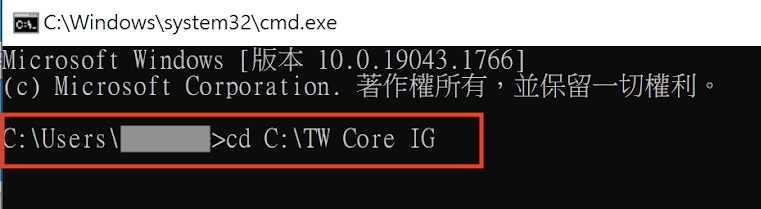
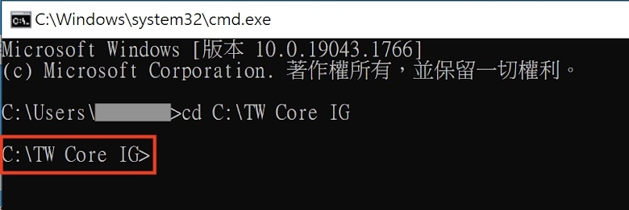

# Validates - 臺灣長期照顧實作指引 (Taiwan Long-Term Care Implementation Guide) v0.4.1

* [**Table of Contents**](toc.md)
* **Validates**

## Validates

本頁將說明如何驗證實作檔是否符合TW LTC IG規範。

### 使用國際 HL7 提供的公開免費驗證器 validator_cli.jar 檔，以命令提示字元測試驗證。

Your browser does not support HTML video.
#### Mac 作業系統

**Step 1：下載 validator_cli.jar 檔**

請至 HL7 驗證說明網站下載 jar 檔：[Confluence Pages of Health Level 7 (HL7) International](https://confluence.hl7.org/display/FHIR/Using+the+FHIR+Validator#UsingtheFHIRValidator-Runningthevalidator)。進入 HL7 驗證說明官網後，如下圖所示請尋找「Downloading the Validator」項目，下載 「[validator_cli.jar](https://github.com/hapifhir/org.hl7.fhir.core/releases/latest/download/validator_cli.jar)」檔。

**Step 2：使用你的病人實例 JSON 檔或者下載範例JSON檔**

注意：請確認範例檔之編碼格式為 UTF-8，否則無法驗證。

以 Patient Profile 的實作為例，如果你的手邊已經有一個依據 TW LTC IG 實作的 JSON 檔，你可以使用你的實例檔案，如果你沒有這樣的檔案，則可以下載如下圖所示的 TW LTC IG的「病人基本資料」範例。如下圖所示，請於 TW LTC IG 網站上，找到範例檔頁面中的「病人基本資料」。

**Step 3：放置 validator_cli.jar 檔與範例檔**

如下圖所示，請創建一個新資料夾，並命名為「TW LTC IG」，將資料夾放於桌面。

如下圖所示，將 Step 1 下載之 jar 檔，及 Step 2 下載之 JSON 檔，放置於所創之 TW LTC IG 資料夾中。
 *這邊只是為了方便驗證時簡化語法及避免太複雜的說明，而將上述兩個檔案放在相同目錄，使用者/實作者可視情況放在不同的目錄或可連線的網址，但後續語法也要自行做相對應的調整。 * 

**Step 4：驗證檔案是否符合 TW LTC IG 網站之 Patient Profiles 格式**

如下圖所示，請於「TW LTC IG 資料夾」按滑鼠右鍵，點選「新增位於檔案夾位置的終端機視窗」。

＊無「新增位於檔案夾位置的終端機視窗」：若於資料夾按滑鼠右鍵後，找不到「新增位於檔案夾位置的終端機視窗」，可開啟系統偏好設定，選擇鍵盤並切換置快速鍵，並於左方選擇服務，並在服務內找到「新增位於檔案夾位置的終端機視窗」且打勾其選項。

成功新增檔案位置於終端機時，會如下圖所示，其終端機會指向「TW LTC IG 資料」。

如下圖所示，請於「終端機」輸入 FHIR 提供的驗證程式－紅色1『***java -jar validator_cli.jar***』、要驗證的Profile實例-藍色2『***Patient-pat-example.json***』，以及驗證的規格依據-橘色3 『***-version 4.0 -ig fhir.twltc***』，「Enter鍵入」，即可查看驗證結果。

若驗證「通過」，如下圖所示，可看到「Success: 0 errors, 0 warnings, 1 notes」。

若驗證「不通過」，如下圖所示，可看到「*FAILURE*: 2 errors, 0 warnings, 0 notes」，可看出 Patient 裡的 contact 有錯誤，位置於第 106 行及第 108 行。再依據錯誤訊息修改實例後重新驗證，直到驗證成功為止，即表示實例符合 Profile 定義。

#### Windows作業系統

**Step 1：下載validator_cli.jar檔**

請至HL7驗證說明網站下載jar檔：[Confluence Pages of Health Level 7 (HL7) International](https://confluence.hl7.org/display/FHIR/Using+the+FHIR+Validator#UsingtheFHIRValidator-Runningthevalidator)。進入HL7驗證說明官網後，如下圖所示請尋找「Downloading the Validator」項目，下載「[validator_cli.jar](https://github.com/hapifhir/org.hl7.fhir.core/releases/latest/download/validator_cli.jar)」檔。

**Step 2：使用你的病人實例JSON檔或者下載範例JSON檔**

以Patient Profile的實作為例，如果你的手邊已經有一個依據TW LTC IG實作的JSON檔，你可以使用你的實例檔案，如果你沒有這樣的檔案，則可以下載如下圖所示的TW LTC IG的「病人基本資料」範例。如下圖所示，請於TW LTC IG網站上，找到範例檔頁面中的「病人基本資料」。

**Step 3：放置validator_cli.jar檔與範例檔**

如下圖所示，請創建一個新資料夾，並命名為「TW LTC IG」，將資料夾放於Ｃ槽。

如下圖所示，將Step 1下載之jar檔，及Step 2下載之JSON檔，放置於所創之TW LTC IG 資料夾中。
 *這邊只是為了方便驗證時簡化語法及避免太複雜的說明，而將上述兩個檔案放在相同目錄，使用者/實作者可視情況放在不同的目錄或可連線的網址，但後續語法也要自行做相對應的調整。*

**Step 4：驗證檔案是否符合TW LTC IG網站之Patient Profiles格式**

如下圖所示，請使用「Windoes鍵 + R鍵」 開啟「執行」對話框，輸入『***cmd***』，開啟「命令列提示字元」。

如下圖所示，請輸入 『
***cd＋ [TW LTC IG 資料夾存放位址]***』。

如下圖所示，可看到命令列環境指向TW LTC IG資料夾。

如下圖所示，請於指向TW LTC IG資料夾命令列環境，輸入FHIR提供的驗證程式－紅色1『 ***java -jar validator_cli.jar***』 、所要驗證之Profile-藍色2『***Patient-pat-example.json***』，以及所要驗證之依據-橘色3 『***-version 4.0 -ig fhir.twltc***』，「Enter鍵入」。

如下圖若驗證「通過」，可看到「Success: 0 errors, 0 warnings, 1 notes」。

若驗證「不通過」，如下圖所示，可看到「*FAILURE*: 2 errors, 0 warnings, 0 notes」，可看出Patient裡的contact有錯誤，位置於第106行及第108行。再依據錯誤訊息修改實例後重新驗證，直到驗證成功為止，即表示實例符合Profile定義。

#### 補充說明-本機端驗證

**手動下載IG Package**

可於[結構定義與範例檔下載頁](downloads.md)下載整個IG的[Package](package.tgz)。Package Cache檔案路徑如下：

* Windows：c:\users\<username>\.fhir\packages

* Unix/Linux：/~/.fhir/packages

可試跑語法確認Package Cache路徑與所設定路徑一致。

在.fhir\packages路徑下創建一個資料夾並命名為`tw.gov.mohw.twcore#0.1.1`，將package.tgz解壓縮的package資料夾放置於此。（此處以0.1.1版為例，請根據實際所需的版本更改內容）

本機端驗證可減省validator程式抓取IG Package number資訊的時間，兩種方式皆可驗證，使用者可自行選擇。

